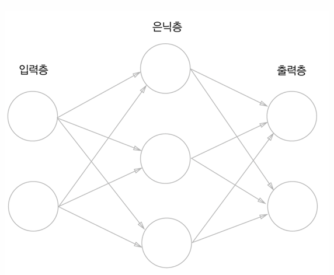

## MNIST 데이터셋을 활용한 머신러닝 API 구현

## MNIST란?
- 머신러닝 및 딥러닝 알고리즘의 성능 평가에 사용되는 손글씨 숫자 데이터셋
- 0 ~ 9까지의 숫자가 포함된 그레이스케일 이미지들로 구성되어 있으며, 각 이미지 크기는 28 X 28 픽셀
- 총 70,000개의 이미지로 구성되어 있음:
    - 60,000개는 훈련 데이터 (training data)
    - 10,000개는 테스트 데이터 (test data)
- MNIST는 주로 숫자 분류 문제에 사용되며, 주어진 손글씨 이미지를 보고 어떤 숫자인지를 예측하는 작업을 수행

## 신경망 모델을 이용한 MNIST 분류
신경망 모델:
- 생물학적인 뇌의 뉴런이 신호를 주고 받는 방식을 모방하여 설계된 기계 학습 모델
- 신경망은 여러 뉴런이 모여 이루어진 레이어로 구성
- 레이어의 종류:
    - 입력층 (Input Layer): 신경망에 데이터를 입력하는 첫 번째 레이어
        - 데이터의 각 특성이 뉴런으로 입력됨
    - 은닉층 (Hidden Layer): 입력과 출력을 연결하는 중간 레이어
        - 은닉층이 많을수록 신경망의 깊이가 깊어져 딥러닝이라 부름
    - 출력층 (Output Layer): 예측 결과를 출력하는 마지막 레이어
        - 분류 문제에서는 각 클래스의 확률을 출력하거나 회귀 문제에서는 숫자 값을 출력

    

## 모델 생성 과정
```bash
models/mnist_model.ipynb 에서 확인 가능
```

## 프로젝트 구조
```bash
Project
    ├── mnist_images            # 테스트할 mnist 이미지들
    │  
    ├── models
    │   ├── mnist_model.ipynb   # 모델 생성 과정
    │   └── mnist_model.pth     # 생성된 모델
    ├── modules
    │   ├── data_processing.py  # 전처리기 구현
    │   └── models.pth          # 모델 구현
    │
    ├── static
    │   └── css
    │       └── style.css
    │   └── js
    │       └── mnist.js        # 이미지 업로드 기능 구현
    │
    ├── templates
    │   └── index.html
    │
    ├── app.py                  # Flask 애플리케이션 구현
    ├── README.md               # 프로젝트 개요 및 사용법 설명 
    └── requirements.txt        # 프로젝트의 필수 패키지 목록
```

## 실행 방법
1. 가상환경 생성
    ```bash
    python -m venv venv
    ```
2. 가상환경 활성화
    ```bash
    venv\Scripts\activate
    ```
3. 의존성 설치
    ```bash
    pip install -r requirements.txt
    ```
4. 웹 시스템 실행
    ```bash
    python app.py
    ```
브라우저에서 http://localhost:5000으로 접속하여 시스템을 확인할 수 있다.

## 결과


테스트할 MNIST 이미지를 업로드하면,


해당 이미지가 어떤 숫자인지 예측하는 기능을 제공하는 결과를 볼 수 있다.